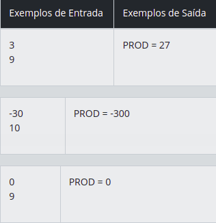
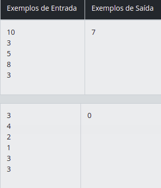
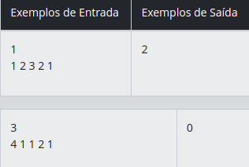
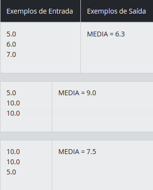
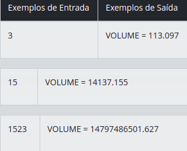
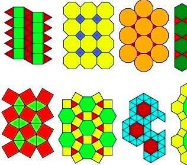
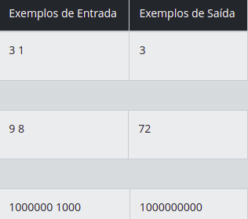
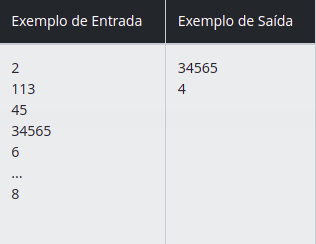

### Seja bem vindo aos Desafios de Codigo do Bootcamp GFT Start Woman :mortar_board:

### Desafios básicos em Java

#### [1] [Multiplicação Simples](./src/dio/me/gft/ProdutoSimples.java)

##### Desafio : Você receberá dois valores inteiros. Faça a leitura e em seguida calcule o produto entre estes dois valores. Atribua esta operação à variável **PROD,** mostrando esta de acordo com a mensagem de saída esperada (exemplo abaixo).  

#### Entrada : A entrada contém 2 valores inteiros.

#### Saída : Exiba a variável **PROD** conforme exemplo abaixo, tendo obrigatoriamente um espaço em branco antes e depois da igualdade.

#### [2] [Coxinha de Bueno](./src/dio/me/gft/CoxinhaDeBueno.java)

#### Desafio : Em 2015 um novo record foi alcançado na competição de Coxinhas de Bueno de Andrada, onde Mônica mandou pra dentro 43 coxinhas em apenas 10 minutos, passando se antecessor que conseguiu comer, no mesmo tempo, 38 coxinhas em 2014.
#### O restaurante especializado em coxinhas do pequeno distrito de Bueno de Andrada, interior de São Paulo, organiza essa competição todos os anos, mas nunca conseguiram entrar para o livro dos recordes, o Guinness Book. Para isso, o restaurante precisa preencher informações sobre a competição, como o número de coxinhas consumidas pelos competidores durante o evento. 
#### Porém, como jó foi informado, a especialidade deles é coxinha, não matemática, então será que você pode ajudá-los? Com base no número total de coxinhas consumidas e o número de participantes na competição, o dono do restaurante precisa que você desenvolva um programa para saber a quantidade média de coxinha que os participantes da competição conseguem devorar.

#### Entrada : A entrada consiste de uma única linha que contém dois inteiros H e P (1 ≤ H, P ≤ 1000) indicando respectivamente o número total de coxinhas consumidas e o número total de participantes na competição.

#### Saída : Seu programa deve produzir uma única linha com um número racional representando o número médio de coxinhas consumidas pelos participantes. O resultado deve ser escrito como um número racional com exatamente dois dígitos após o ponto decimal, arredondado se necessário.Ah, lembre que, em troca da sua ajuda, você poderá comer quantas coxinhas conseguir

#### [3] [Álbum da Copa](./src/dio/me/gft/AlbumDaCopa.java)

#### Desafio : A Copa do Mundo de Futebol é um dos maiores eventos esportivos do Planeta Terra, e o álbum de figurinhas oficial é sempre um grande sucesso entre os amantes dessa competição. O álbum contém espaços numerados de 1 a N para colar as figurinhas; cada figurinha, também numerada de 1 a N, é uma pequena foto de um jogador de uma das seleções que jogará a Copa do Mundo. O objetivo é colar todas as figurinhas nos respectivos espaços no álbum, de modo a completar o álbum, ou seja, não deixar nenhum espaço sem a correspondente figurinha.
#### As figurinhas são vendidas em envelopes fechados, de forma que o comprador não sabe quais figurinhas está comprando, e pode ocorrer de comprar uma figurinha que ele já tenha colado no álbum.
#### Para ajudar os usuários, a empresa responsável pela venda do álbum e das figurinhas quer criar um aplicativo que permita gerenciar facilmente as figurinhas que faltam para completar o álbum e está solicitando a sua ajuda.
#### Dados o número total de espaços e figurinhas do álbum, e uma lista das figurinhas já compradas (que pode conter figurinhas repetidas), o seu desafio é determinar quantas figurinhas faltam para completar o álbum.

#### Entrada: A primeira linha contém um inteiro N (1 ≤ N ≤ 100) indicando o número total de figurinhas e espaços no álbum. A segunda linha contém um inteiro M (1 ≤ M ≤ 300) indicando o número de figurinhas já compradas. Cada uma das M linhas seguintes contém um número inteiro X (1 ≤ X ≤ N) indicando uma figurinha já comprada.

#### Saída : Seu programa deve produzir uma única linha contendo um inteiro representando o número de figurinhas que falta para completar o álbum.

#### [4] [Degustação de Vinho](./src/dio/me/gft/DegustacaoDeVinho.java)

#### Desafio : Degustação de vinho às escuras é a habilidade de identificar um vinho usando apenas seus sentidos do olfato e paladar. Durante uma competição de degustação, uma garrafa de vinho é aberta e dividia em taças para que os cinco competidores possam provar. Eles podem cheiras, saborear e avaliar a bebida para conseguir identificar qual o tipo do vinho, sendo: (1) Cabernet; (2) Merlot; (3) Pinot Noir. No final, as respostas são verificadas para determinar o número de suposições corretas. Dado o qual foi o tipo do vinho e as respostas fornecidas, determine o número de participantes que receberam a resposta correta.

#### Entrada : A primeira linha contém um inteiro T representando o tipo de vinho (1 ≤ T ≤ 4). A segunda linha contém cinco inteiros A, B, C, D e E, que indica a resposta dada por cada competidor (1 ≤ A, B, C, D, E ≤ 4).

#### Saída : A saída contém um inteiro representando o número de concorrentes que obtiveram a resposta correta.

### Desafios Intermediários em Java

#### [1] [Média 2](./src/dio/me/gft/Media2.java)

#### Desafio :  Leia 3 valores, no caso, variáveis A, B e C, que são as três notas de um aluno. A seguir, calcule a média do aluno, sabendo que a nota A tem peso 2, a nota B tem peso 3 e a nota C tem peso 5. Considere que cada nota pode ir de 0 até 10.0, sempre com uma casa decimal.

#### Entrada : O arquivo de entrada contém 3 valores com uma casa decimal, de dupla precisão (double).

#### Saída : Imprima a variável MEDIA conforme exemplo abaixo, com 1 dígito após o ponto decimal e com um espaço em branco antes e depois da igualdade. Assim como todos os problemas, não esqueça de imprimir o fim de linha após o resultado, caso contrário, você receberá "Presentation Error".

#### [2] [Esfera](./src/dio/me/gft/Esfera.java)

#### Desafio : Faça um programa que calcule e mostre o volume de uma esfera sendo fornecido o valor de seu raio (R). A fórmula para calcular o volume é: (4/3) * pi * R3. Considere (atribua) para pi o valor 3.14159.
#### Dica: Ao utilizar a fórmula, procure usar (4/3.0) ou (4.0/3), pois algumas linguagens (dentre elas o C++), assumem que o resultado da divisão entre dois inteiros é outro inteiro.

#### Entrada : O arquivo de entrada contém um valor de ponto flutuante (dupla precisão), correspondente ao raio da esfera.

#### Saída : A saída deverá ser uma mensagem "VOLUME" conforme o exemplo fornecido abaixo, com um espaço antes e um espaço depois da igualdade. O valor deverá ser apresentado com 3 casas após o ponto.

#### [3] [Polígonos Regulares Simples](./src/dio/me/gft/PoligonosRegularesSimples.java)

#### Desafio : Na geometria Euclidiana, um polígono regular é um polígono em que todos os ângulos são iguais e todos os lados tem o mesmo comprimento. Um polígono simples é aquele cujos segmentos de reta não se interceptam. Abaixo pode-se ver vários mosaicos feitos por polígonos regulares.

#### Entrada : A entrada tem dois inteiros positivos: N e L, que são, respectivamente, o número de lados e o comprimento de cada lado de um polígono regular (3 ≤ N ≤ 1000000 and 1 ≤ L ≤ 4000).

#### Saída : A saída é o perímetro P do polígono regular em uma única linha.

#### [4] [Maior e posição](./src/dio/me/gft/MaiorEposicao.java)

#### Desafio : Você recebeu o desafio de ler 100 valores inteiros. Apresente então o maior valor lido e a posição dentre os 100 valores lidos.

#### Entrada : O arquivo de entrada contém 100 números inteiros, positivos e distintos.

#### Saída : Apresente o maior valor lido e a posição de entrada, conforme exemplo abaixo.

## Obrigado [Digital Innovation One](https://dio.me/sign-up?ref=WDIQVSHDCK)!
