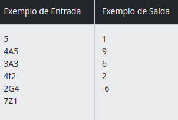

### 1. [Bob Conduite](./src/main/kotlin/dio/me/santander/BobConduite.kt)

#### Desafio : Você tem em mãos dois cabos circulares de energia. O primeiro cabo tem raio R1 e o segundo raio R2. Você precisa comprar um conduite circular (veja a imagem abaixo que ilustra um conduite) de maneira a passar os dois cabos por dentro dele

#### Entrada : A entrada contém vários casos de teste. A primeira linha da entrada contém um inteiro N, indicando o número de casos de teste que virão a seguir. Cada caso de teste é uma sequência de três caracteres criada por Paula. Esta sequência contém na primeira posição um caractere de '0' a '9', na segunda posição uma letra maiúscula ou minúscula do alfabeto e na terceira posição outro caractere de '0' a '9'.

#### Saída : Para cada caso de teste, deve ser impressa uma linha com um valor inteiro que representa a solução da sequência proposta por Paula.

### 2. [O jogo Matemático de Paula](./src/main/kotlin/dio/me/santander/OJogoMatematicoDePaula.kt)

#### Desafio : Paula simplesmente adora matemática. Seu maior passatempo é ficar inventando jogos ou atividades que a envolvam para brincar com seus amiguinhos. Obviamente, nem todos eles não são tão apaixonados assim por matemática e têm muita dificuldade para resolver as brincadeiras propostas por ela. Agora Paula inventou um pequeno passatempo que envolve 3 caracteres: um dígito numérico, uma letra e outro dígito numérico. Se a letra for maiúscula, deve-se subtrair o primeiro dígito do segundo. Se a letra for minúscula, deve-se somar ambos os dígitos e se os DÍGITOS forem iguais, deve-se desconsiderar a letra e mostrar o produto entre os dois dígitos. Ela pediu para seu amigo Marcelo, que é bom em programação, para criar um programa para que encontre a solução para cada uma das sequências que Paula lhe apresentar.

#### Entrada : A entrada contém vários casos de teste. A primeira linha da entrada contém um inteiro N, indicando o número de casos de teste que virão a seguir. Cada caso de teste é uma sequência de três caracteres criada por Paula. Esta sequência contém na primeira posição um caractere de '0' a '9', na segunda posição uma letra maiúscula ou minúscula do alfabeto e na terceira posição outro caractere de '0' a '9'.

#### Saída : Para cada caso de teste, deve ser impressa uma linha com um valor inteiro que representa a solução da sequência proposta por Paula.

### 3. [Múltiplo de 13](./src/main/kotlin/dio/me/santander/MultiplosDeTreze.kt)

#### Desafio : Escreva um algoritmo que leia 2 valores inteiros A e B calcule a soma dos números que não são múltiplos de 13 entre A e B, incluindo ambos.

#### Entrada : O arquivo de entrada contém 2 valores inteiros quaisquer, não necessariamente em ordem crescente.

#### Saída : Imprima a soma de todos os valores não divisíveis por 13 entre os dois valores lidos na entrada, inclusive ambos se for o caso.

