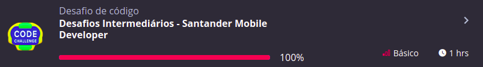
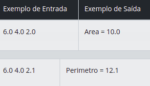
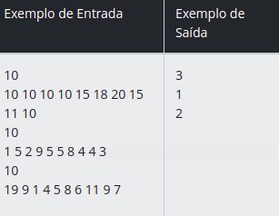
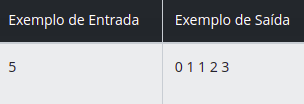

### 1. [Triângulo](./src/main/kotlin/Triangulo.kt)

#### Desafio : Leia 3 valores reais (A, B e C) e verifique se eles formam ou não um triângulo. Em caso positivo, calcule o perímetro do triângulo (soma de todos os lados) e apresente a mensagem:

#### Perimetro = XX.X

#### Em caso negativo, calcule a área do trapézio que tem A e B como base e C como altura, mostrando a mensagem:

#### Area = XX.X

#### __Fórmula da área de um trapézio: AREA = ((A + B) x C) / 2__

#### Entrada : A entrada contém três valores reais.

#### Saída : O resultado deve ser apresentado com uma casa decimal.

### 2. [A corrida das tartarugas](./src/main/kotlin/AcorridaDeTartarugas.kt)

#### Desafio : A corrida de tartarugas é um esporte que cresceu muito nos últimos anos, fazendo com que vários competidores se dediquem a capturar tartarugas rápidas, e treina-las para faturar milhões em corridas pelo mundo. Porém a tarefa de capturar tartarugas não é uma tarefa muito fácil, pois quase todos esses répteis são bem lentos. Cada tartaruga é classificada em um nível dependendo de sua velocidade:

- Nível 1: Se a velocidade é menor que 10 cm/h .

- Nível 2: Se a velocidade é maior ou igual a 10 cm/h e menor que 20 cm/h .
Nível 3: Se a velocidade é maior ou igual a 20 cm/h .

#### Sua tarefa é identificar qual o nível de velocidade da tartaruga mais veloz de um grupo

#### Entrada : A entrada consiste de múltiplos casos de teste, e cada um consiste em duas linhas: A primeira linha contém um inteiro L (1 ≤ L ≤ 500) representando o número de tartarugas do grupo, e a segunda linha contém L inteiros Vi (1 ≤ Vi ≤ 50) representando as velocidades de cada tartaruga do grupo.

#### Saída : Para cada caso de teste, imprima uma única linha indicando o nível de velocidade da tartaruga mais veloz do grupo.

### 3. [Fibonnaci Fácil](./src/main/kotlin/FibonacciFacil.kt)

#### Desafio : A seguinte sequência de números 0 1 1 2 3 5 8 13 21... é conhecida como série de Fibonacci. Nessa sequência, cada número, depois dos 2 primeiros, é igual à soma dos 2 anteriores. Escreva um algoritmo que leia um inteiro N (N < 46) e mostre os N primeiros números dessa série.

#### Entrada : O arquivo de entrada contém um valor inteiro N (0 < N < 46).

#### Saída : Os valores devem ser mostrados na mesma linha, separados por um espaço em branco. Não deve haver espaço após o último valor.

