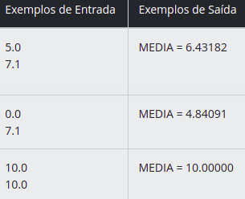
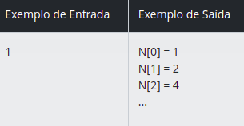
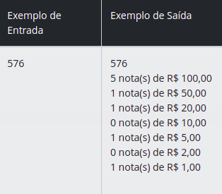

### 1. [Média 1](./src/main/kotlin/dio/me/iniciais/Media1.kt)

#### Desafio : Leia 2 valores de ponto flutuante de dupla precisão A e B, que correspondem a 2 notas de um aluno. A seguir, calcule a média do aluno, sabendo que a nota A tem peso 3.5 e a nota B tem peso 7.5 (A soma dos pesos portanto é 11). Assuma que cada nota pode ir de 0 até 10.0, sempre com uma casa decimal.

#### Entrada : O arquivo de entrada contém 2 valores com uma casa decimal cada um.

#### Saída : Calcule e imprima a variável MEDIA conforme exemplo abaixo, com 5 dígitos após o ponto decimal e com um espaço em branco antes e depois da igualdade. Utilize variáveis de dupla precisão (double) e como todos os problemas, não esqueça de imprimir o fim de linha após o resultado, caso contrário, você receberá "Presentation Error".

### 2. [Preenchimento de Vetor](./src/main/kotlin/dio/me/iniciais/PreenchimentoDeVetorI.kt)

#### Desafio : Você recebeu o desafio de ler um valor e criar um programa que coloque o valor lido na primeira posição de um vetor N[10]. Em cada posição subsequente, coloque o dobro do valor da posição anterior. Por exemplo, se o valor lido for 1, os valores do vetor devem ser 1,2,4,8 e assim sucessivamente. Mostre o vetor em seguida.

#### Entrada : A entrada contém um valor inteiro (V<=50).

#### Saída : Para cada posição do vetor, escreva "N[i] = X", onde i é a posição do vetor e X é o valor armazenado na posição i. O primeiro número do vetor N (N[0]) irá receber o valor de V.

### 3. [Contagem de cédulas](./src/main/kotlin/dio/me/iniciais/ContagemDeCedulas.kt)

#### Desafio : Faça a leitura de um valor inteiro. Em seguida, calcule o menor número de notas possíveis (cédulas) onde o valor pode ser decomposto. As notas que você deve considerar são de 100, 50, 20, 10, 5, 2 e 1. Na sequência mostre o valor lido e a relação de notas necessárias.

#### Entrada : Você receberá um valor inteiro N (0 < N < 1000000).

#### Saída : Exiba o valor lido e a quantidade mínima de notas de cada tipo necessárias, seguindo o exemplo de saída abaixo. Após cada linha deve ser imprimido o fim de linha.

