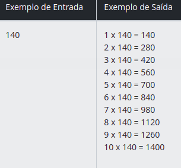
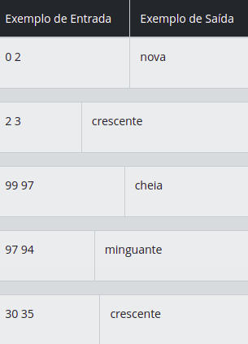
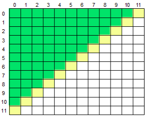
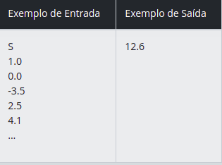

## Seja bem vindo aos Desafios do avançados do Bootcamp Mobile na DIO da Sportheca

### Autor : [Adevan Neves Santos](https://www.linkedin.com/in/adevan-neves-santos/)

### Desafios 

### [Tempo do Dobby](./src/dio/me/exercicios/TempoDoDobby.java)

#### Problema : Para dar conta de toda a fabricação dos presentes de Natal, por várias vezes os elfos precisam ficar até tarde trabalhando para que tudo possa ser terminado a tempo. Para melhor gerenciar seus cronogramas, os elfos estipularam quantos minutos são necessários para fabricar cada presente. Já está quase no final do expediente, e um dos elfos pediu sua ajuda. Faltam N minutos para a hora de ir embora, e restam dois presentes para o elfo Dobby fabricar. Ajude-o a descobrir se ele conseguirá fabricar os dois ainda hoje, ou se deve deixar o trabalho para amanhã.

### Entrada

#### Cada caso de teste inicia com um inteiro N, indicando quantos minutos faltam para o final do expediente (2 <= N <= 100). Em seguida haverá dois inteiros A e B, indicando quantos minutos são necessários para fabricar os dois presentes que Dobby precisa fabricar (1 <= A, B <= 100).

### Saída

#### Imprima uma linha, contendo a frase "Farei hoje!" caso seja possível fabricar os dois presentes antes do final do expediente, ou "Deixa para amanha!" caso contrário.

### [Tabuada](./src/dio/me/exercicios/Tabuada.java) 

#### Problema : Leia 1 valor inteiro N (2 < N < 1000). A seguir, mostre a tabuada de N: 1 x N = N      2 x N = 2N        ...       10 x N = 10N

### Entrada

#### A entrada contém um valor inteiro N (2 < N < 1000).

### Saída

#### Imprima a tabuada de N, conforme o exemplo fornecido.

### [Fases da LUA](./src/dio/me/exercicios/FasesDaLua.java)

#### Problema : Jade ganhou de presente de aniversário um telescópio e ficou muito feliz, pois adora olhar a lua à noite. Ela sempre foi uma estudante muito boa, e só analizando a lua por duas noites seguidas, já consegue identificar as mudanças que ocorreram na iluminação e o percentual aproximado da lua que está iluminada.

#### Você, que é amigo da Jade e estuda Computação, resolveu fazer um pequeno programa que, baseado nesta avaliação que ela fez nas duas últimas noites, informa a fase na qual a lua se encontra. Se a porção visível da lua no momento estiver entre 0 e 2%, por exemplo, é lua nova, se for entre 3 e 96% é lua crescente, se for entre 97 e 100% é lua cheia e se for entre 96 e 3% (diminuindo) é lua minguante.

### Entrada

#### A entrada é composta por uma única linha contendo dois valores inteiros. O primeiro valor corresponde ao percentual observado por Jade na noite de dois dias atrás. O segundo valor corresponde ao percentual observado por jade na noite anterior.

### Saída

#### Baseado nos dois percentuais observados por Jade, imprima na tela a fase na qual a lua se encontrava na noite anterior, conforme o exemplo abaixo. Não esqueça de imprimir o caractere de fim de linha após a saída :).

### [Acima da Diagonal Secundária](./src/dio/me/exercicios/AcimaDaDiagonalSecundaria.java)

#### Problema : Leia um caractere maiúsculo, que indica uma operação que deve ser realizada e uma matriz M[12][12]. Em seguida, calcule e mostre a soma ou a média considerando somente aqueles elementos que estão acima da diagonal secundária da matriz, conforme ilustrado abaixo (área verde).

### Entrada

#### A primeira linha de entrada contem um único caractere Maiúsculo O ('S' ou 'M'), indicando a operação (Soma ou Média) que deverá ser realizada com os elementos da matriz. Seguem os 144 valores de ponto flutuante que compõem a matriz.

### Saída

#### Imprima o resultado solicitado (a soma ou média), com 1 casa após o ponto decimal.

### Obrigado [Digital Innovation One](https://dio.me/sign-up?ref=WDIQVSHDCK) pela Oportunidade !