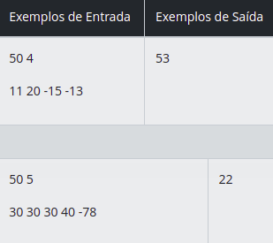
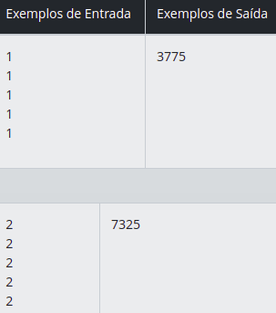
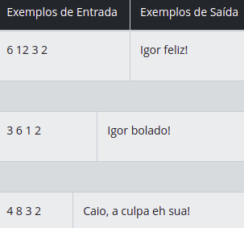

## Olá, seja bem vindos aos Desafios de código do Bootcamp Sportheca Mobile Developer !

### Autor: [Adevan Neves Santos](https://www.linkedin.com/in/adevan-neves-santos/)

### Sobre o projeto : Chegou a hora de colocar todo o conhecimento adquirido no Bootcamp em prática ! Os desafios de código são problemas computacionais na qual o estudante irá utilizar a programação para construir a solução correta e validar nos testes abertos e fechados. No contexto deste bootcamp, serão realizados na linguagem Java.

### Desafios em Java - Sportheca

### Volume da TV

#### Bruno é um menino que gosta muito de ver televisão. No entanto ele se depara com um problema muito chato. Sempre que começa um novo programa no canal preferido dele, a TV Nlogônia, acontece de o volume do som deste programa estar diferente do anterior, às vezes com volume menor, outras vezes com volume maior. Quando está com volume menor, ele aumenta o volume pressionando uma quantidade de vezes seguidas o botão de aumentar para o volume ficar ideal; a mesma coisa acontece quando está um volume maior, e ele diminui o volume pressionando alguma quantidade de vezes seguidas o botão de diminuir o volume para ficar com o volume que ele goste no momento.

#### O aparelho de TV dele tem umas peculiaridades: ele possui volume mínimo, com valor 0 (também chamado de mudo), e volume máximo, com valor 100. A TV nunca ultrapassa os volumes máximo e mínimo. Por exemplo, se o volume já estiver no máximo e ele pressionar o botão de aumentar o som, o volume não se altera. Da mesma forma, se o volume estiver no valor mínimo e ele pressionar o botão de diminuir o som, o volume não se altera.

#### Agora Bruno quer sua ajuda: ele lembra qual era o volume inicial da TV, e quantas vezes ele pressionou cada botão. Mas, como foram várias mudanças de volume, ele não sabe qual é o volume atual da TV. Por isso, pediu que você o ajude a calcular qual é o volume atual, dados o volume inicial e a lista de trocas de volume que ele realizou.

### - Entrada

#### A primeira linha da entrada contém dois números inteiros V (0 ≤ V ≤ 100) e T (0 ≤ T ≤ 1000), que indicam, respectivamente, o volume inicial e o número de trocas de volume.

#### A segunda linha contém T números inteiros Ai (−100 ≤ Ai ≤ 100) que mostram as modificações de volume realizadas, na ordem em que estas modificações foram feitas. O primeiro número indica a primeira modificação de volume, o segundo número indica a segunda modificação, e assim por diante. Para cada modificação, um número maior do que zero significa quantas vezes Bruno pressionou o botão de aumentar o som; um número menor do que zero significa quantas vezes ele pressionou o botão de diminuir o som. Ou seja, se o número é igual a 5, significa que nessa modificação ele pressionou cinco vezes o botão de aumentar o som; se o número é igual a −3, significa que nessa modificação ele pressionou o botão de diminuir o som três vezes.

### - Saída

#### Seu programa deve imprimir apenas uma linha, contendo apenas um inteiro F, que indica qual o volume atual da TV após as mudanças de volume.

## [Solução](./src/dio/me/desafios/AparelhoTV.java)

#### OBI - Olimpíada Brasileira de Informática 2013 Fase 2 Nível Júnior.

### Quanta Mandioca ?

#### Os meses de Junho e Julho são tradicionalmente conhecidos por todo Brasil por suas festas típicas, e para o grupo de amigos da Marlene não é diferente, toda segunda quinzena do mês de Julho ela e seus amigos se reunem para tradicional mandiocada! Na festiva sempre se reúnem na casa da Marlene, o Chico, o Beto, o Bernardo, a Marina e a Iara. E como não poderia ser diferente o prato principal dessa reunião é a mandioca. Cada um deles come de uma a dez porções de mandioca e eles sempre avisam a Marlene com antecedência a respeito de quantas porções irão comer nesse dia. O tamanho da porção de cada um é diferente, mas sempre são os mesmos. As porções são as seguintes (em gramas):

- O Chico come 300
- O Bento come 1500
- O Bernardo come 600
- A Marina 1000
- A Iara come 150

#### Marlene por sua vez sempre come 225 gramas de mandioca. Cansada de todo ano ter que calcular quanta mandioca preparar ela te desafiou para escrever um programa que informe quanta mandioca deve ser preparada em gramas.

### - Entrada

#### A entrada consiste de 5 inteiros cada um representando as porções que os convidados de dona Chica vão consumir. O primeiro inteiro representa as porções do Chico, o segundo do Bento, o terceiro do Bernardo, o quarto da Marina e o quinto a da Iara.

### - Saída

#### A saída consiste de um único inteiro que representa quanta mandioca Marlene deve preparar em gramas.

## [Solução](./src/dio/me/desafios/QuantaMandioca.java)

### Imprevistos Natalinos

#### Igor é professor de programação, e com a chegada do Natal, tempos de festas e viagens, em sua sala está ocorrendo muitos imprevistos, tanto em número de alunos quanto com problemas nos computadores por conta das férias do estagiário da TI. Jazon é um aluno muito dedicado e deseja ajudar seu professor, porém ainda é um aspirante na programação, por isso pediu sua ajuda para contabilizar o número de computadores que estarão funcionando em um dia específico desse mês natalino, e se é suficiente para o número total de alunos. Se o número de computadores funcionais for insuficiente para o total de alunos, não haverá aula.

#### O aluno também falou alguns detalhes:

- Igor, o professor, sempre utiliza um dos computadores.
- Caio é muito desastrado e queimou um número X de computadores.
- Existe um número Y de computadores que não possuem compilador instalado.

### - Entrada

#### A entrada é composta por um número A (0 < C <= 1000) de alunos e C (A <= C <= 1000) que corresponde ao número de computadores. Além disso deve ser recebido um número X (X <= C <= 100) de computadores queimados por Caio e um número Y (Y <= C <= 1000) de computadores que não possuem compilador.

### - Saída

#### Caso não tenha aula, imprima ”Igor bolado!”, mas se, sobre essa mesma condição, o número de computadores queimados por Caio for maior que a metade dos computadores que não possuem compilador, imprima somente: “Caio, a culpa eh sua!”. Caso tenha aula, imprima ”Igor feliz!”.

#### Questão desenvolvida pelos alunos Izaias Machado, Francisco Jazon, Tainá Falcão e Guilherme Praciano

#### Contest de Natal 2018

## [Solução](./src/dio/me/desafios/ImprevistosNatalinos.java)