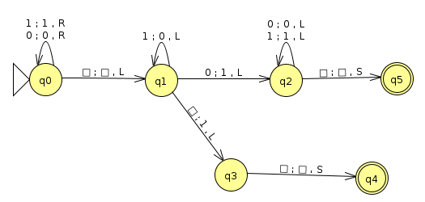
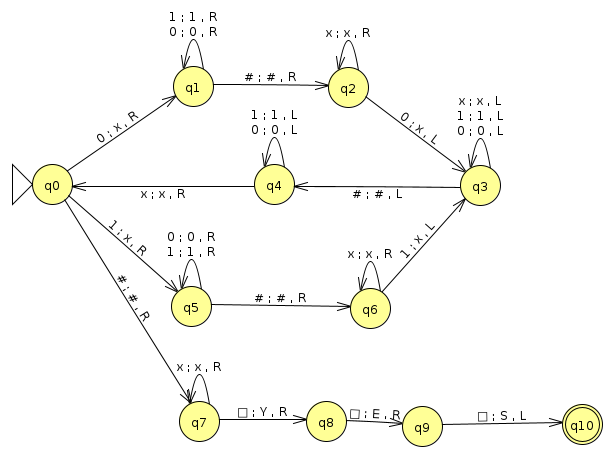
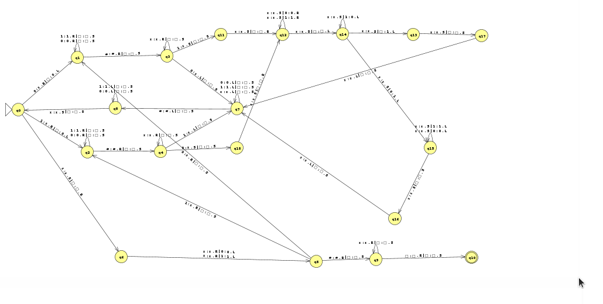
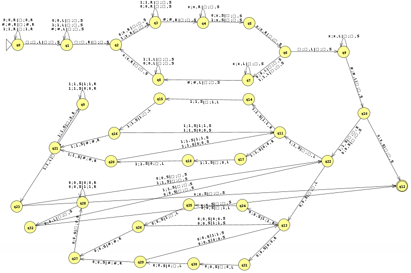
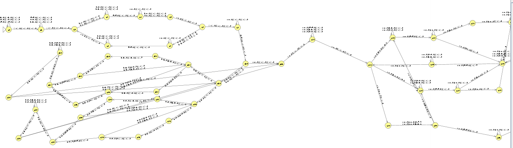
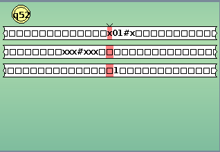
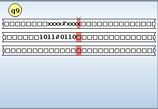

### Olá ! Seja bem vindo a apresentação da máquina de Turing que resolve o problema do cálculo da distância de Hamming .

### Autor:[Adevan Neves Santos](https://www.linkedin.com/in/adevan-neves-santos/)

#### Sobre o projeto : Máquina de Turing Calculadora da Distância de Hamming
#### (a) Entrada: x#y, em que x, y ∈ {0, 1}⁺ são dois números inteiros e positivos denotados na base binária;
#### (b) Saída: x#y = z, em que z ∈ {0, 1}⁺ é o resultado da distância de Hamming bit a bit entre x e y;
#### (c) Para x, y e z, considera-se o bit mais significativo está à esquerda;

#### (d) Note que tanto pode haver situações em que |x| 6= |y|. Nesses casos, a string de menor tamanho deve ser interpretada como tendo sido acrescida de zeros à esquerda até completar o tamanho da maior string.

## Apresentação da solução :

##### 1.1 Construindo uma máquina de Turing que incrementa em 1 na entrada binária.



##### 1.2 Construindo uma máquina de Turing que verifica palíndromos com a mesma quantidade de bits



##### 1.3 Conntruindo uma máquina de Turing que verifica a paridade de uma entrada x#y tal que |x| == |y|.



##### 1.4 Construindo uma máquina de Turing que acrescenta zeros a esquerda de y quando x é maior que ele.



##### 1.5 Juntando todas em um só projeto !



### Resumo : A máquina utiliza irá comparar cada bit em x com seu correspondente em y e realizar a contagem de quantos bits são diferentes, utilizando também o sistema binário para representar a quantidade exata. Neste contexto, a primeira fita armazena a entrada original do usuário, enquanto a segunda fita representa a entrada com a correção de tamanho exigida, caso necessite. a última fita irá ser inicializada com zero assim que o MT começar a percorrer a entrada correta e será acrescentado 1 em binário para cada vez que ele encontrar um símbolo que não "casa" com outro símbolo.

#### Verificando robustez na prática.

#### 1) Exemplo e teste

#### Entrada  
```bash
101#1
```

#### Resultado Esperado
```bash
1
```

#### O que o modelo respondeu :

##### Tratamento de tamanho na segunda fita


##### Resposta na última fita




#### 2) Exemplo e teste

#### Entrada  
```bash
1011#0110
```

#### Resultado Esperado
```bash
11
```

#### O que o modelo respondeu :

##### Tratamento de tamanho na segunda fita



##### Resposta na última fita


#### Obrigado !!!!