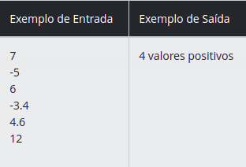
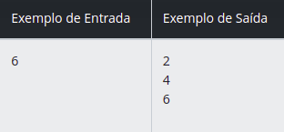
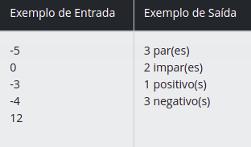
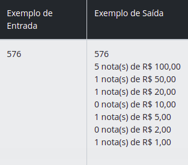
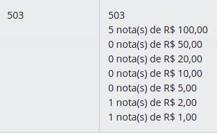
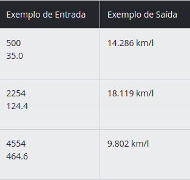

### Seja bem vindo ao Desafio 2 do Bootcamp Java Developer ! Fundamentos aritméticos em Java

#### Autor : [Adevan Neves Santos](https://www.linkedin.com/in/adevan-neves-santos/)

### 1. [Quantidade de Números Positivos](./src/dio/me/aritmetica/QuantidadeDeNumerosPositivos.java)

#### Desafio : Crie um programa que leia 6 valores, os quais poderão ser negativos e/ou positivos. Em seguida, apresente a quantidade de valores positivos digitados.

#### Entrada : Você receberá seis valores, negativos e/ou positivos.

#### Saída : Exiba uma mensagem dizendo quantos valores positivos foram lidos. assim como é exibido abaixo no exemplo de saída. Não se esqueça de incluir na mensagem de saída o sufixo " valores positivos", conforme o exemplo abaixo:

### 2. [Exibindo Números Pares](./src/dio/me/aritmetica/ExibindoNumerosPares.java)

#### Desafios :  Crie um programa que leia um número e mostre os números pares até esse número, inclusive ele mesmo.

#### Entrada : Você receberá 1 valor inteiro N, onde N > 0.

### Saída : Exiba todos os números pares até o valor de entrada, sendo um em cada linha. 

### 3. [Análise de números](./src/dio/me/aritmetica/AnaliseDeNumeros.java) 

#### Desafio : Você deve fazer a leitura de 5 valores inteiros. Em seguida mostre quantos valores informados são pares, quantos valores informados são ímpares, quantos valores informados são positivos e quantos valores informados são negativos. Considere que o número zero é positivo, mas não pode ser considerado como positivo ou negativo.

#### Entrada : Você receberá 5 valores inteiros.

#### Saída : Exiba a mensagem conforme o exemplo de saída abaixo, sendo uma mensagem por linha e não esquecendo o final de linha após cada uma.

### 4. [Contagem de cédulas](./src/dio/me/aritmetica/ContagemDeCedulas.java)

#### Desafio : Faça a leitura de um valor inteiro. Em seguida, calcule o menor número de notas possíveis (cédulas) onde o valor pode ser decomposto. As notas que você deve considerar são de 100, 50, 20, 10, 5, 2 e 1. Na sequência mostre o valor lido e a relação de notas necessárias.

#### Entrada : Você receberá um valor inteiro N (0 < N < 1000000).

#### Saída : Exiba o valor lido e a quantidade mínima de notas de cada tipo necessárias, seguindo o exemplo de saída abaixo. Após cada linha deve ser imprimido o fim de linha.

### 5. [Consumo Médio de Automòvel](./src/dio/me/aritmetica/ConsumoMedioDeAutomovel.java)

#### Desafio : Você deve calcular o consumo médio de um automóvel onde será informada a distância total percorrida (em Km) e o total de combustível consumido (em litros).

#### Entrada : Você receberá dois valores: um valor inteiro X com a distância total percorrida (em Km), e um valor real Y que representa o total de combustível consumido, com um dígito após o ponto decimal.

#### Saída : Exiba o valor que representa o consumo médio do automóvel (3 casas após a vírgula), incluindo no final a mensagem "km/l".

### Obrigado [Digital Innovation One](https://dio.me) !