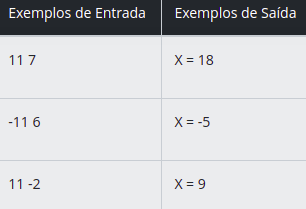
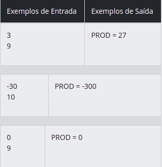
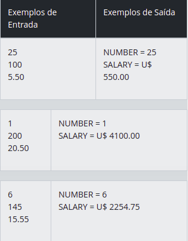

### Seja bem vindo ao primeiro Desafio de código no Bootcamp Java Developer !

#### Autor : [Adevan Neves Santos](https://www.linkedin.com/in/adevan-neves-santos/)

## 1. [Visita na feira](./src/dio/me/introducao/VisitaNaFeira.java)

#### Desafio : Você está na feira com a sua sacola e parou em uma banca. O feirante lhe entregou pimentões amarelos e vermelhos. Agora iremos somar os pimetões amarelos e vermelhos para descobrir o total de pimentões na sacola.  Você receberá 2 inteiros que devem ser lidos e armazenados nas variáveis A (pimentões amarelos) e B (pimentões vermelhos). Faça a soma de A e B atribuindo o seu resultado na variável X (total de pimentões). Apresente X como descrito na mensagem de exemplo abaixo. Não apresente outra mensagem além da mensagem especificada.

#### Entrada : A entrada contém 2 valores inteiros, separados por um espaço.

#### Saída : Imprimir a mensagem "X = " (sendo a letra X maiúscula) seguido pelo valor da variável X e pelo final de linha. Assegure que exista um espaço antes e depois do sinal de igualdade.

## 2. [Multiplicação Simples](./src/dio/me/introducao/MultiplicacaoSimples.java)

#### Desafio : Você receberá dois valores inteiros. Faça a leitura e em seguida calcule o produto entre estes dois valores. Atribua esta operação à variável PROD, mostrando esta de acordo com a mensagem de saída esperada (exemplo abaixo).  

#### Entrada : A entrada contém 2 valores inteiros.

#### Saída : Exiba a variável PROD conforme exemplo abaixo, tendo obrigatoriamente um espaço em branco antes e depois da igualdade.

## 3. [Folha de pagamento](./src/dio/me/introducao/FolhaDePagamento.java)

#### Desafio : Precisamos saber quanto uma determinada empresa deve pagar para seus colaboradores, porém temos apenas a quantidade de horas trabalhadas e o valor hora. Escreva um programa que leia o número de um colaborador, seu número de horas trabalhadas, o valor que recebe por hora e calcula o salário desse colaborador. Em seguida, apresente o número e o salário do colaborador, com duas casas decimais.

#### Entrada : Você receberá 2 números inteiros e 1 número com duas casas decimais, representando o número, quantidade de horas trabalhadas e o valor que o funcionário recebe por hora trabalhada.

#### Saída : Exiba o número e o salário do colaborador, conforme exemplo abaixo, com um espaço em branco antes e depois da igualdade. No caso do salário, também deve haver um espaço em branco após o $.

#### Obrigado [Digital Innovation One](https://dio.me) !