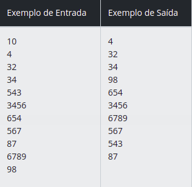
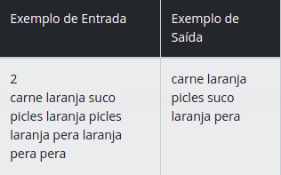

### Seja bem vindo ao Desafio Ordenação e Filtros em Java !

### Autor :[Adevan Neves Santos](https://www.linkedin.com/in/adevan-neves-santos/)

### [1] [Ordenando Números Pares e Ímpares](./src/dio/me/ordft/OrdenacaoNumerosParesImpares.java)

#### Desafio : Crie um programa onde você receberá valores inteiros não negativos como entrada.

#### Ordene estes valores de acordo com o seguinte critério:

-  Primeiro os Pares
-  Depois os Ímpares

#### Você deve exibir os pares em ordem crescente e na sequência os ímpares em ordem decrescente.

#### Entrada : A primeira linha de entrada contém um único inteiro positivo N (1 < N < 10000) Este é o número de linhas de entrada que vem logo a seguir. As próximas N linhas terão, cada uma delas, um valor inteiro não negativo.

#### Saída : Exiba todos os valores lidos na entrada segundo a ordem apresentada acima. Cada número deve ser impresso em uma linha, conforme exemplo de saída abaixo.

#### [2] [Compras no Supermercado](./src/dio/me/ordft/ComprasNoSupermercado.java)

#### Desafio : Pedro trabalha sempre até tarde todos os dias, com isso tem pouco tempo tempo para as tarefas domésticas. Para economizar tempo ele faz a lista de compras do supermercado em um aplicativo e costuma anotar cada item na mesma hora que percebe a falta dele em casa. O problema é que o aplicativo não exclui itens duplicados, como Pedro anota o mesmo item mais de uma vez e a lista acaba ficando extensa. Sua tarefa é melhorar o aplicativo de notas desenvolvendo um código que exclua os itens duplicados da lista de compras e que os ordene alfabeticamente.

#### Entrada : A primeira linha de entrada contém um inteiro N (N < 100) com a quantidade de casos de teste que vem a seguir, ou melhor, a quantidade de listas de compras para organizar. Cada lista de compra consiste de uma única linha que contém de 1 a 1000 itens ou palavras compostas apenas de letras minúsculas (de 1 a 20 letras), sem acentos e separadas por um espaço.

#### Saída : A saída contém N linhas, cada uma representando uma lista de compra, sem os itens repetidos e em ordem alfabética.

