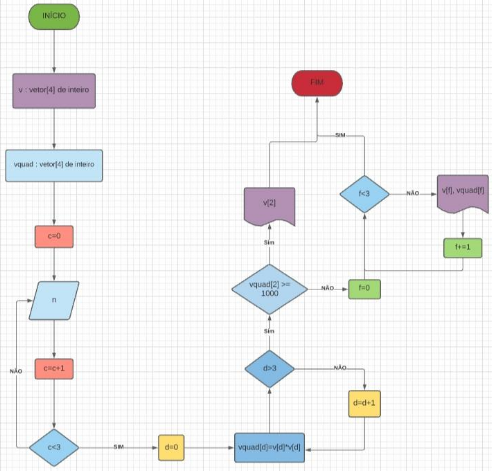

## Seja bem vindo ao Lógica de Programação Essencial

### Autor:[Adevan Neves Santos](https://www.linkedin.com/in/adevan-neves-santos/)

### Sobre o projeto : A lógica de programação é um dos requisitos mais importantes para o sucesso de todo programador. No início, sofri com dificuldade de aprender lógica diretamente na linguagem de programação, no meu caso o Python. Porém, ao dar um passo atrás e estudar pseudócodigos, teste de mesa e fluxogramas recuperei a confiança de que eu era capaz de evoluir nesta área. Portanto, caso você tenha curiosade de como projetar um algoritmo de maneira mais conceitual, da maneira que até uma pessoa inciante entenda eu separei mais de __100__ exercícios de lógica de programação em arquivos com extensão docx. Você irá encontrar pseudocódigos, fluxogramas e narrativas empregadas na elbaoração e teste de algoritimos.



```python
VAR 
    idade : inteiro
    nome : vetor[40] de caractere
Início
    Imprimir (“ Digite o seu nome :”)
    Leia(nome)
    Imprimir (“ Digite a sua idade :”)
    Leia(idade)
    Imprimir (“ Se nome é “, nome)
    Imprimir (“ Sua idade é “, idade, “ anos “)
Fim
```