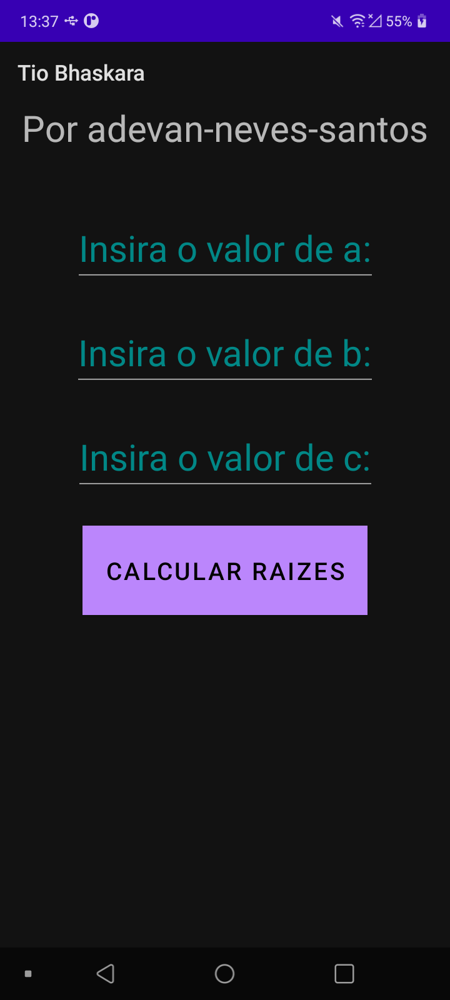
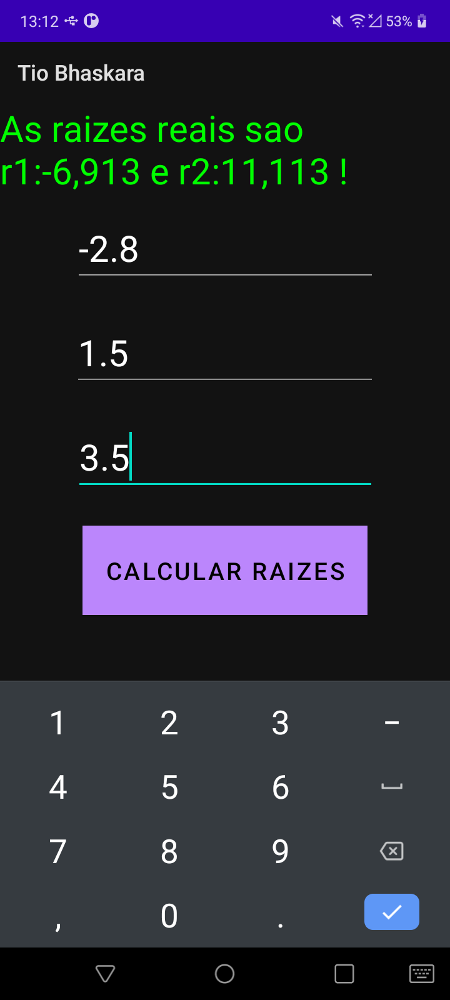
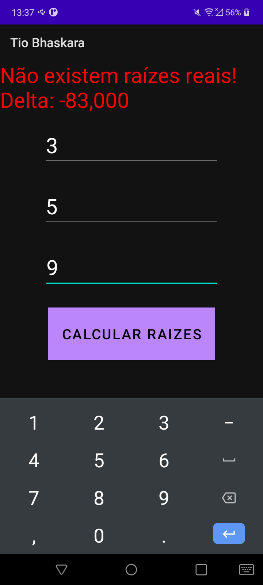
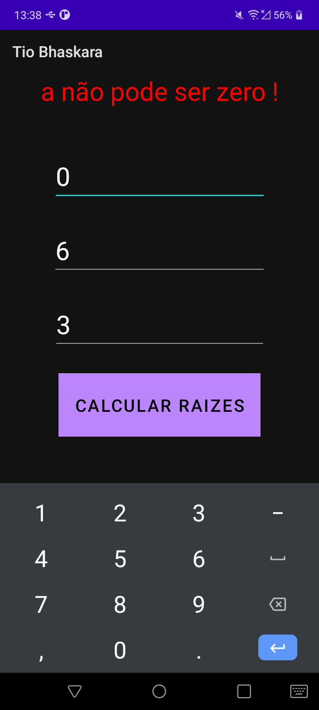
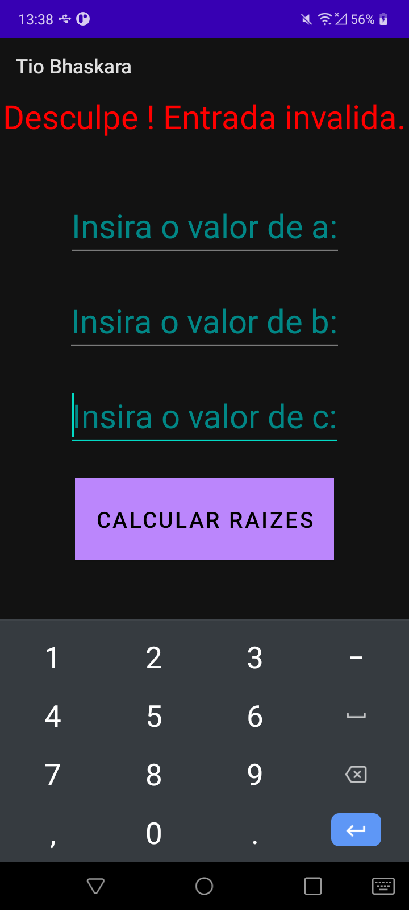

### Olá pessoal ! Sejam bem vindos ao App Android TIO Bhaskara :mortar_board:

#### Autor : [Adevan Neves Santos](https://www.linkedin.com/in/adevan-neves-santos/)

#### Sobre o projeto: O App Mobile  Tio Bhaskara é um app simples cujo objetivo é calcular as raízes de uma equação de segundo grau por meio da fórmula de bhaskara e os coeficientes numéricos de uma equação do tipo : ax² + bx +c = 0

#### 1. Abertura do app:

#### 2. Encontrando as raízes :

#### 3. Não encontrando raízes reais :

#### 4. O valor de a não pode ser zero :

#### 5. Valor vazio ou em branco não são permitidos :
