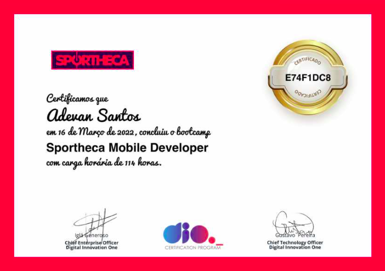

## Olá ! Seja bem vindo ao repositório de exercícios do Bootcamp Mobile na [DIO](https://dio.me/sign-up?ref=WDIQVSHDCK) em parceria com a [Sportheca](https://sportheca.io/ptbr/) .

#### Autor : [Adevan Neves Santos](https://www.linkedin.com/in/adevan-neves-santos/)
#### Período : [18.01.2022 -  29.03.2022]

### Sobre o projeto : O Sportheca Mobile Developer é o programa em parceria com a Sportheca no qual os futuros talentos terão a oportunidade de fomentar ainda mais seus conhecimentos em desenvolvimento mobile nativo para android.

- Desenvolva aplicações de alto nível com as melhores práticas do mercado;

- Pratique com experts em mentorias ao vivo;
Conecte-se com uma comunidade de tecnologia vibrante;
- Conquiste as melhores oportunidades do mercado e alcance o seu sucesso profissional!

### São 5.000 bolsas que serão distribuídas para devs de todas as senioridades. Depois do bootcamp, você poderá emitir o seu certificado e ainda ter a oportunidade de ser indicado(a) às vagas abertas na Sportheca.

#### Aprendizado : No começo de 2022 obtive interesse em desenvolvimento mobile nativo para Android devido ao [Sportheca Mobile Dev Week](https://www.dio.me/dev-week/sportheca/mobile) e também ao [Santander Mobile e Fullstack Dev Week](https://www.dio.me/dev-week/santander/bootcamps),pois utilizamos como projeto base um app de simulação de partidas, afinal 2022 é o ano da Copa. Devido ao conhecimentos de Orientação Objetos na graduação, estava familiarizado com Java e decidir apostar neste universo de apps. O bootcamp é completo, nele os alunos concluíram diversos projetos práticos desde de a "famosa" calculadora de IMC até um app para apresentação de portifólio. Após o curso, a minha confiança na área de desenvolvimento de software aumentou, assim como meu repertório de ferramentas.
